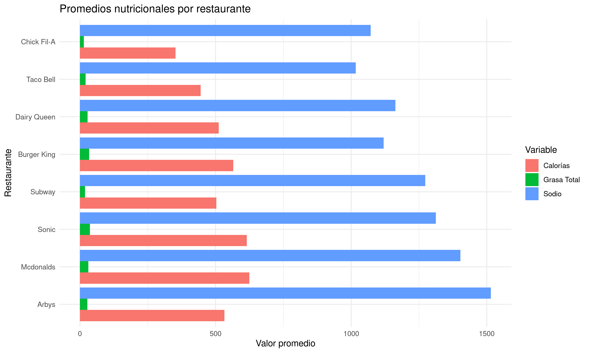

# 🍔 Análisis Nutricional de Comida Rápida - Minería de Datos

Este repositorio contiene un proyecto desarrollado como parte de una **evaluación del curso de Minería de Datos**, centrado en el análisis de información nutricional de productos ofrecidos por distintas cadenas de comida rápida.

## 📁 Estructura del Proyecto
```text
├── evaluacion_CG.R             # Script principal con el análisis y visualizaciones
├── fastfood_calories.csv       # Dataset original con información nutricional
├── valores_final.csv           # Dataset enriquecido y final
├── clasificacion_items.csv     # Clasificación de productos (saludable/no saludable)
├── info_restaurantes.csv       # Información complementaria de los restaurantes
├── grafico_promedio_restaurantes.png
├── grafico_cant_items_saludables.png
├── grafico_promedios_nutricionales.png
└── README.md
```

## 🧠 Objetivo

Aplicar el proceso KDD (Knowledge Discovery in Databases) para **descubrir patrones y tendencias** en los productos de comida rápida, con especial foco en la **salubridad nutricional**.

---

## 🔬 Etapas del KDD aplicadas

1. **Selección**:  
   Se seleccionó un dataset con información nutricional de comidas rápidas de diferentes cadenas (calorías, grasas, sodio, etc.).

2. **Preprocesamiento**:  
   - Limpieza de datos nulos
   - Eliminación de columnas innecesarias
   - Normalización de nombres
   - Detección y eliminación de duplicados

3. **Transformación**:  
   - Cálculo de métricas adicionales:
     - % calorías provenientes de grasa
     - Índice de salud
     - Relación sodio/proteína
   - Clasificación de productos como “saludables” o “no saludables”

4. **Minería de Datos**:  
   - Análisis comparativo entre restaurantes
   - Agrupaciones por categoría nutricional
   - Identificación de patrones en los datos

5. **Interpretación y evaluación**:  
   - Visualización de resultados mediante gráficos
   - Generación de conclusiones sobre la calidad nutricional

---

## 📊 Principales Visualizaciones

- Promedio de calorías, grasas y sodio por restaurante
- Conteo de productos saludables y no saludables por cadena
- Comparación de métricas nutricionales por categoría

Ejemplo:



---

## 🧩 Tecnologías utilizadas

- **Lenguaje:** R  
- **Librerías:** `ggplot2`, funciones personalizadas para métricas y transformaciones  
- **Formato adicional:** `.Rmd` para generación de informes reproducibles

---

## 👨‍💻 Autor

- **Cristóbal Gallardo**  
  Evaluación para el curso de Minería de Datos  
  Mayo 2025

---

## 📄 Licencia

Medica, porfavor