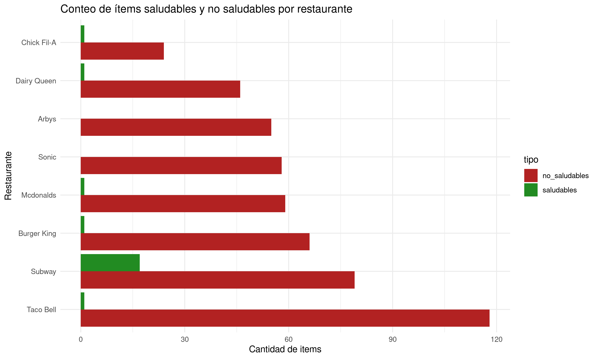

---
title: "Informe de Minería de Datos"
author: "Cristóbal Gallardo"
output: html_document
---

<hr>

## Análisis Nutricional de <span style="color:green">COMIDA </span>  <span style="color:red">RÁPIDA</span>  


<hr>

### Etapa 4: Minería de datos

En esta etapa se aplican métodos analíticos para descubrir patrones y relaciones útiles dentro del conjunto de datos. En este proyecto, la minería de datos se enfocó en analizar los alimentos ofrecidos por distintas cadenas de comida rápida, a partir de métricas nutricionales diseñadas para evaluar su salubridad.

Las principales acciones realizadas en esta etapa fueron:

- Clasificación de productos en "Saludables" o "No saludables":

    Se definieron criterios basados en umbrales nutricionales. A través de la función es_saludable_func, se evaluó cada alimento para determinar si cumple con estas condiciones.
```{r, eval = FALSE}
    es_saludable_func <- function(df) {
    with(df,
        calories < 500 &
        total_fat < 20 &
        sat_fat < 5 &
        sugar < 10 &
        fiber > 3 &
        protein > 15
    )
    }
```

- Agrupación y conteo por restaurante:

    Se contó cuántos productos saludables y no saludables ofrece cada cadena de comida rápida mediante la función conteo_saludables(), revelando qué restaurantes priorizan opciones más sanas.


```{r, eval = FALSE}
    conteo_saludables <- function(df, grupo_var = "restaurant") {
        # Aplicar la función es_saludable_func a cada fila del dataframe
        df$es_saludable <- es_saludable_func(df)
        tabla <- aggregate(es_saludable ~ get(grupo_var), data = df, FUN = function(x) c(saludables = sum(x), no_saludables = sum(!x)))
        conteo <- do.call(data.frame, tabla)
        # Crea una nueva columna con el nombre del grupo
        colnames(conteo) <- c(grupo_var, "saludables", "no_saludables")

        variable <- rep(c("saludables", "no_saludables"), each = nrow(conteo))
        valor <- c(conteo$saludables, conteo$no_saludables)
        grupo <- rep(conteo[[grupo_var]], times = 2)
        
        datos_largos <- data.frame(grupo = grupo, tipo = variable, cantidad = valor)
        colnames(datos_largos)[1] <- grupo_var
        
        return(datos_largos)
    }
```

- Cálculo de métricas derivadas:

    Se crearon nuevas variables para analizar los productos desde una perspectiva más amplia, incluyendo:

    - Porcentaje de calorías provenientes de grasas (porc_calorias_grasa)

    - Índice de salud (indice_salud), que combina fibra, proteína, grasas saturadas y azúcares

    - Relación sodio/proteína (sodio_por_proteina)


```{r, eval = FALSE}
    porc_calorias_grasa <- function(df) {
        df$calories * df$total_fat / 100
    }
    
    indice_salud <- function(df) {
        (df$fiber + df$protein - df$sat_fat - df$sugar) / 2
    }
    
    sodio_por_proteina <- function(df) {
        df$sodium / df$protein
    }
```

- Resumen de métricas por categoría:

    Se calcularon promedios de calorías, grasas y sodio por restaurante y categoría, utilizando la función comparacion_por_restaurantes() para obtener un resumen claro y visualizable.

```{r, eval = FALSE}
    comparacion_por_restaurantes <- function(df, grupo_var = "restaurant") {
    # Calcular promedios
    resumen <- aggregate(cbind(calories, total_fat, sodium) ~ get(grupo_var), data = df, FUN = mean, na.rm = TRUE)
    # Renombrar la columna de grupo para que siempre se llame igual
    colnames(resumen)[1] <- grupo_var
    variable <- rep(c("Calorías", "Grasa Total", "Sodio"), each = nrow(resumen))
    valor <- c(resumen$calories, resumen$total_fat, resumen$sodium)
    grupo <- rep(resumen[[grupo_var]], times = 3)
    datos_largos <- data.frame(
        grupo = grupo,
        variable = variable,
        valor = valor
    )
    colnames(datos_largos)[1] <- grupo_var
    return(datos_largos)
    }
```

<br>

```{r setup, include=FALSE}
knitr::opts_chunk$set(echo = TRUE, warning = FALSE, message = FALSE)
library(ggplot2)

# Cargar datos
valores_final <- read.csv("valores_final.csv")

# Función para resumen por restaurante
comparacion_por_restaurantes <- function(df, grupo_var = "restaurant") {
  # Calcular promedios
  resumen <- aggregate(cbind(calories, total_fat, sodium) ~ get(grupo_var), data = df, FUN = mean, na.rm = TRUE)
  # Renombrar la columna de grupo para que siempre se llame igual
  colnames(resumen)[1] <- grupo_var
  variable <- rep(c("Calorías", "Grasa Total", "Sodio"), each = nrow(resumen))
  valor <- c(resumen$calories, resumen$total_fat, resumen$sodium)
  grupo <- rep(resumen[[grupo_var]], times = 3)
  datos_largos <- data.frame(
    grupo = grupo,
    variable = variable,
    valor = valor
  )
  colnames(datos_largos)[1] <- grupo_var
  return(datos_largos)
}

# Aplicar función y graficar
datos_para_grafico <- comparacion_por_restaurantes(valores_final)

grafico <- ggplot(datos_para_grafico, aes(x = reorder(restaurant, -valor), y = valor, fill = variable)) +
  geom_col(position = "dodge") +
  labs(title = "Promedios nutricionales por restaurante",
       x = "Restaurante",
       y = "Valor promedio",
       fill = "Variable") +
  theme_minimal() +
  coord_flip()
print(grafico)
```

<br>

```{r, include=FALSE}
# Función para resumen por categoría
promedio_por_categoria <- function(df, grupo_var = "categoria") {
  resumen <- aggregate(cbind(porc_calorias_grasa, indice_salud, sodio_por_proteina) ~ categoria, data = df, FUN = mean, na.rm = TRUE)
  colnames(resumen)[1] <- grupo_var
  variable <- rep(c("% Calorías x grasas", "Indice Salud", "Sodio x Proteina"), each = nrow(resumen))
  valor <- c(resumen$porc_calorias_grasa, resumen$indice_salud, resumen$sodio_por_proteina)
  grupo <- rep(resumen[[grupo_var]], times = 3)
  datos_largos <- data.frame(grupo = grupo, variable = variable, valor = valor)
  colnames(datos_largos)[1] <- grupo_var
  return(datos_largos)
}

# Aplicar función y graficar
tabla_categoriaS <- promedio_por_categoria(valores_final)

ggplot(subset(tabla_categoriaS, variable == "% Calorías x grasas"),
       aes(x = reorder(categoria, -valor), y = valor)) +
  geom_col(fill = "lightblue") +
  labs(title = "Porcentaje de calorías de grasa por categoría",
       x = "Categoría", y = "% Calorías provenientes de grasa") +
  theme_minimal() +
  coord_flip()
```

<br>

```{r, include=FALSE}
#### Gráfico
ggplot(valores_final, aes(x = protein, y = sodium)) +
  geom_point(alpha = 0.4, color = "darkgreen") +
  labs(title = "Promedios nutricionales por categoría",
       x = "Proteína (g)", y = "Sodio (mg)") +
  theme_minimal()
```

### Etapa 5: Evaluación e interpretación
En esta sección se presentan los gráficos generados a partir de los datos analizados. Se incluyen gráficos de barras y de dispersión para ilustrar las relaciones entre diferentes variables nutricionales.
<br>

#### Gráfico 1: Promedios nutricionales por restaurante

El gráfico revela que, en promedio, todos los restaurantes tienen un contenido de sodio considerablemente alto en sus ítems, especialmente Arby’s. Aunque algunos restaurantes como Subway o Chick Fil-A presentan menores valores en calorías o grasa, su aporte de sodio sigue siendo elevado, lo que cuestiona la percepción general sobre su "salubridad".

Por otro lado, McDonald's y Taco Bell tienen un alto contenido de sodio y calorías, lo que refuerza la imagen negativa asociada a estos restaurantes. En general, el gráfico sugiere que la mayoría de los restaurantes de comida rápida ofrecen productos con altos niveles de sodio, calorías y grasas, lo que puede ser perjudicial para la salud si se consumen en exceso.

<br>

#### Gráfico 2: Porcentaje de calorías provenientes de grasa por categoría

El gráfico presenta una comparación entre la cantidad de productos saludables (verde) y no saludables (rojo) ofrecidos por distintas cadenas de comida rápida. Se pueden destacar las siguientes observaciones:

##### **Restaurantes con opciones saludables notorias:**
Subway es el restaurante con mayor número de ítems saludables, lo cual es consistente con su imagen de marca enfocada en lo “fresco” y “saludable”. Es el único que presenta una barra verde claramente visible y considerablemente mayor a las demás.
<br>

Burger King, Chick Fil-A y Taco Bell tienen algunos ítems saludables, pero en una proporción mínima respecto a los no saludables.

##### **Restaurantes con poca o nula oferta saludable:**
Dairy Queen, Arby’s, Sonic y McDonald's presentan una ausencia casi total de productos saludables. Sus barras están dominadas por el color rojo, lo que indica una oferta centrada en productos altos en calorías, grasas, sodio o bajos en fibra y proteínas.
<br>

Se puede visualizar el desequilibrio nutricional presente en la oferta de comida rápida. Aunque algunos restaurantes como Subway muestran esfuerzos hacia una alimentación más saludable, la mayoría sigue priorizando opciones poco nutritivas. Esta información es clave para consumidores conscientes y también podría ser útil para políticas públicas o campañas de concientización.

<br>

#### Gráfico 3: Promedios nutricionales por categoría

El gráfico muestra la relación entre el contenido de sodio y proteína en los productos de comida rápida. A continuación se presentan las observaciones más relevantes:

1. % Calorías x grasas:

    - Más alto en la categoría No saludable, lo que indica que estos productos dependen más de las grasas para su aporte calórico.

    - Menor en la categoría Saludable, lo cual es deseable desde el punto de vista nutricional.

2. Índice Salud:

    - Levemente más alto en la categoría Saludable, como era de esperarse.

    - La diferencia no es tan grande, lo que podría sugerir que no todos los productos clasificados como “no saludables” son pésimos desde este índice.

3. Sodio x Proteína:

    - Ambas categorías tienen valores altos, pero los productos No saludables tienen un valor ligeramente mayor.

    - Esto sugiere que incluso algunos alimentos etiquetados como saludables pueden tener mucho sodio en relación a su proteína.

### Conclusiones
El análisis de los gráficos presentados evidencia una tendencia generalizada en la industria de comida rápida hacia productos con altos niveles de sodio, calorías y grasas, lo cual representa un riesgo para la salud si se consumen de forma habitual. Si bien existen excepciones como Subway, que ofrece una mayor proporción de productos saludables, la gran mayoría de las cadenas analizadas presentan una oferta desequilibrada y poco nutritiva.

Además, aunque ciertos ítems son clasificados como “saludables”, estos no siempre destacan significativamente en indicadores clave como el índice de salud o el contenido relativo de sodio frente a la proteína. Esto sugiere que la etiqueta de “saludable” puede ser relativa y requiere un análisis más profundo de los componentes nutricionales.

En conjunto, estos resultados ponen en evidencia la necesidad de mayor transparencia nutricional, así como de acciones informadas tanto por parte de los consumidores como de las propias cadenas de alimentos y políticas públicas, para fomentar una oferta más equilibrada y consciente.